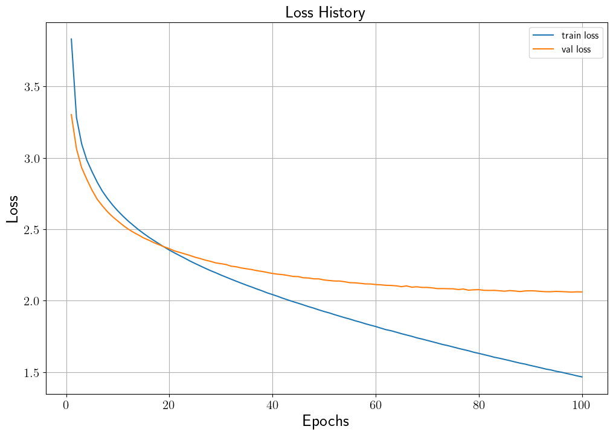

# Text CLIP to Retrieve Proper Answer
## 설명
CLIP은 OpenAI에서 공개한 image-text 쌍 데이터를 이용하여 데이터의 representation을 학습한 multi-modal 모델입니다.
본 코드는 image-text가 아닌 text-text 쌍 데이터를 이용하여 들어온 query에 대해서 적절한 답을 검색하여 내어주는 retrieval를 위한 text-CLIP 모델을 학습합니다.
본 프로젝트에서 사용한 데이터는 AI Hub의 일상 대화 데이터를 사용했습니다.
본 코드의 자세한 설명은 [Text-CLIP을 이용한 질의 응답 retrieval 모델 학습](https://ljm565.github.io/contents/clip2.html)을 참고하시기 바랍니다.
<br><br><br>

## 모델 종류
* ### Contrastive Language-Image Pre-training (CLIP)
    일상 대화 데이터를 모델 학습을 위해 bi-turn으로 묶어서 BERT 기반으로 text-CLIP을 학습합니다.
<br><br><br>


## 사용 데이터
* AI Hub 일상 대화 데이터
<br><br>


## 사용 방법
* ### 학습 방법
    학습을 시작하기 위한 argument는 4가지가 있습니다.<br>
    * [-d --device] {cpu, gpu}, **필수**: 학습을 cpu, gpu로 할건지 정하는 인자입니다.
    * [-m --mode] {train, test, inference}, **필수**: 학습을 시작하려면 train, 학습된 모델을 가지고 있어서 test set의 결과를 보려면 inference, 질의에 대한 검색된 여러 답변 및 top-k accuracy를 확인하고싶으면 test로 설정해야합니다. inference, test 모드를 사용할 경우, [-n, --name] 인자가 **필수**입니다.
    * [-c --cont] {1}, **선택**: 학습이 중간에 종료가 된 경우 다시 저장된 모델의 체크포인트 부분부터 학습을 시작할 수 있습니다. 이 인자를 사용할 경우 -m train 이어야 합니다. 
    * [-n --name] {name}, **선택**: 이 인자는 -c 1 혹은 -m {test, inference} 경우 사용합니다.
    중간에 다시 불러서 학습을 할 경우 모델의 이름을 입력하고, test를 할 경우에도 실험할 모델의 이름을 입력해주어야 합니다(최초 학습시 src/config.json에서 정한 모델의 이름의 폴더가 형성되고 그 폴더 내부에 모델 및 모델 파라미터가 json 파일로 형성 됩니다).<br><br>

    터미널 명령어 예시<br>
    * 최초 학습 시
        ```
        python3 src/main.py -d cpu -m train
        ```
    * 중간에 중단 된 모델 이어서 학습 시
        <br>주의사항: config.json을 수정해야하는 일이 발생 한다면 base_path/src/config.json이 아닌, base_path/src/model/{model_name}/{model_name}.json 파일을 수정해야 합니다.
        ```
        python3 src/main.py -d gpu -m train -c 1 -n {model_name}
        ```
    * 최종 학습 된 모델의 test set에 대한 결과를 확인할 시
        <br>주의사항: config.json을 수정해야하는 일이 발생 한다면 base_path/src/config.json이 아닌, base_path/src/model/{model_name}/{model_name}.json 파일을 수정해야 수정사항이 반영됩니다.
        ```
        python3 src/main.py -d cpu -m inference -n {model_name}
        ```
    <br><br>

* ### 모델 학습 조건 설정 (config.json)
    **주의사항: 최초 학습 시 config.json이 사용되며, 이미 한 번 학습을 한 모델에 대하여 parameter를 바꾸고싶다면 base_path/src/model/{model_name}/{model_name}.json 파일을 수정해야 합니다.**
    * base_path: 학습 관련 파일이 저장될 위치.
    * model_name: 학습 모델이 저장될 파일 이름 설정. 모델은 base_path/src/model/{model_name}/{model_name}.pt 로 저장.
    * loss_data_name: 학습 시 발생한 loss data를 저장하기 위한 이름 설정. base_path/src/loss/{loss_data_name}.pkl 파일로 저장. 내부에 중단된 학습을 다시 시작할 때, 학습 과정에 발생한 loss 데이터를 그릴 때 등 필요한 데이터를 dictionary 형태로 저장.
    * max_len: 각 문장의 최대 길이.
    * layernorm_eps: Layer normalization layer epsilon.
    * batch_size: batch size 지정.
    * epochs: 학습 epoch 설정.
    * lr: learning rate 지정.
    * early_stop_criterion: Validation set의 최대 accuracy를 내어준 학습 epoch 대비, 설정된 숫자만큼 epoch이 지나도 나아지지 않을 경우 학습 조기 종료.
    <br><br><br>


## 결과
* ### Text-CLIP 학습 결과
    * Loss History<br>
    (학습을 100 epoch을 진행하였지만, loss는 100 떨어지고 있었음)
    <br><br>

    * Test set loss: 2.057 (98 epoch)<br>
    (Validation set의 가장 낮은 loss를 달성했을 때 모델의 test set 결과)<br><br>

    * Top-k Accuracy<br>
        Test set에 대해서 Query에 대한 검색한 답변에 대한 top-k accuracy 계산 결과
        * Top-1 accuracy: 9.59%
        * Top-5 accuracy: 19.36%
        * Top-10 accuracy: 24.52%<br><br>

    * 질의 응답 검색 된 결과 예시<br>
        "<i>결과 순위 (score): 검색 응답</i>"
        ```
        src:  그러니까 요즘 티비 많이 없애기도 하더라고
        gt    (0.436461): 우리집도 엄마만 보고 거의 방치 중
        trg 0 (0.503683): 아 티비는 전화 오잖아 언제 온다고
        trg 1 (0.486441): 요즘 안 되는 게 어[UNK]어요 다들 그렇게 찾아서 봐요
        trg 2 (0.469811): 가족 다 같이 볼 수 있는 재미있는 예능이나 드라마가 나오면 좋겠네
        trg 3 (0.461624): 티비 채널은 많은데 볼 건 더럽게 없음 하하
        trg 4 (0.455565): 크롬캐스트 있으면 티비가 태블릿인데 필요없지
        trg 5 (0.452497): 근데 직캠으로 보는 게 더 편하긴 해
        trg 6 (0.452101): 어[UNK]지... 재방송을 이렇게 많이 하다니 했네
        trg 7 (0.441696): 음... 아니면 넷플이나 유튜브 어때!
        trg 8 (0.437568): 웅 요즘 어린이들도 봐줬으면 좋겠다... [UNK]
        trg 9 (0.436461): 우리집도 엄마만 보고 거의 방치 중
        --------------------------------------------------

        src:  하하 맞아 별보면서 누워서 애기하고!
        gt    (0.374822): 히히 담에 계획에 추가!
        trg 0 (0.625003): 밤에는 별도 볼 수 있어가지고
        trg 1 (0.541977): 맛있는거 먹고 해안도로 드라이브하고 오면 좋을 것 같아 하하
        trg 2 (0.522523): 자연을 볼 수 있어서 좋은 것 같아 하하
        trg 3 (0.521262): 그래 별도 보고 맛난거도 싸가서 먹고!
        trg 4 (0.517485): 하하 그치 우리는 눈이 즐거워지니까!
        trg 5 (0.496617): 웅웅 근데 밤이라고 생각을 안하는건가?
        trg 6 (0.493339): 응응 하하 생각만 해도 좋다
        trg 7 (0.488552): 도시락싸들고 수목원에 가고 싶어
        trg 8 (0.482880): 하하 전에 친구가 갔는데 부럽더라고
        trg 9 (0.480914): 응응 여름에 노을지는 하늘도 예뻤는데 요즘 구름 장난없더라 하하
        --------------------------------------------------

        src:  응응 우리 둘 다 그거 마셔 보자!
        gt    (0.530809): 좋아~! 근데 맛은 있을까...
        trg 0 (0.582727): 엉~ 한 박스는 엄마랑 같이 나눠 마시자
        trg 1 (0.553225): 좋아좋아 우리 다음 달에 먹으면 되겠다!
        trg 2 (0.549304): 같이 사서 나눠 먹자!
        trg 3 (0.538502): 좋지 그럼 내일 너네 집으로 갈게~
        trg 4 (0.534017): 완전 좋아~!
        trg 5 (0.530809): 좋아~! 근데 맛은 있을까...
        trg 6 (0.520944): 응 집에 갈 때 음료수 사갈까?
        trg 7 (0.484110): 응 그래 주면 나야 고맙지 [UNK]
        trg 8 (0.480300): 그래 완전 좋아
        trg 9 (0.478684): 응 좋아!
        --------------------------------------------------
        ```
    


<br><br><br>
